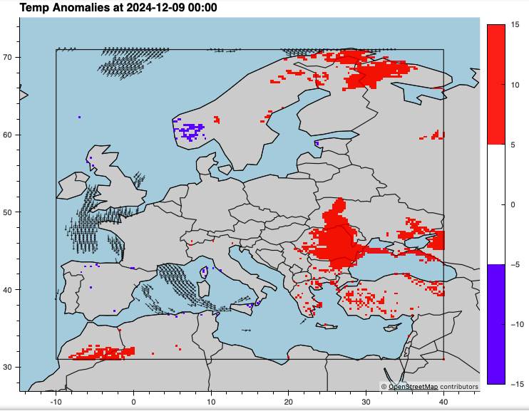

# Weather Forecast Visualization Tool

A Python-based tool for visualizing temperature anomalies and wind patterns in a specific region. Built using **Xarray**, **Cartopy**, and **GeoViews**, this project leverages **AWS** and **Jupyter Notebook** for streamlined data processing and visualization.

## Features
- **Temperature Anomalies**: Color-coded maps highlighting deviations from climatological norms, with transparency for non-anomalous areas.
- **Wind Visualization**: Displays high-speed wind vectors (>15 m/s) with direction and magnitude.
- **Geographic Context**: Includes coastlines, borders, and a clear outline of the region of focus (default: Europe).

## How to Use
1. **Setup**:
   - Ensure you have access to AWS for data storage and retrieval.
   - Download the required datasets (temperature and wind data in NetCDF or GRIB format).
2. **Run the Jupyter Notebook**:
   - Open the provided `.ipynb` file in Jupyter Notebook.
   - Follow the step-by-step cells to load data, process anomalies, and generate visualizations.
3. **Adjust the Region**:
   - Update latitude and longitude bounds to focus on a different area (default: Central America).
4. **View and Save**:
   - View interactive maps directly in the notebook or export static images as needed.

This tool is ideal for climate research, analysis, and educational presentations.

## Questions

### How did you handle accessing large datasets over S3/GCP?
I used an EC2 instance in eu-west-2, strategically placed near an ECMWF data hub for low-latency access. I utilized s3fs for anonymous access and implemented parallel downloads with ThreadPoolExecutor. Files were filtered to include only necessary ones and stored locally to enable efficient and repeatable processing.

### What methods did you use to minimize data transfer and loading times?

While I don't have extensive experience in this area, I used parallel downloads to reduce transfer times and filtered files by type (.grib2) to avoid unnecessary data retrieval. Additionally, I processed data in chunks to manage memory usage efficiently during analysis.

### If the dataset size increases or new variables are added, how would your application accommodate these changes?

I primarily worked with the variables 10v and 10u for wind speed and 2t for temperature. Adding new variables would involve updating the filter logic in the code, leveraging Xarray’s flexible data handling. For larger datasets, I would continue using chunked processing to avoid overloading the memory and crashing the Jupyter notebook kernel.

### How do you ensure reliability of the system for continuous testing?

I implemented thorough exception handling, logging, and checks for missing files to ensure smooth operation. While Jupyter notebooks allowed for efficient testing on locally stored data during development, transitioning to automated workflows or scripts would enhance reliability for production environments.
